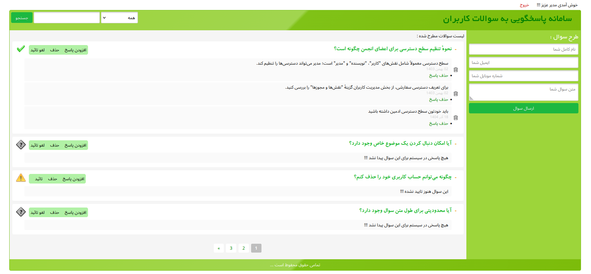
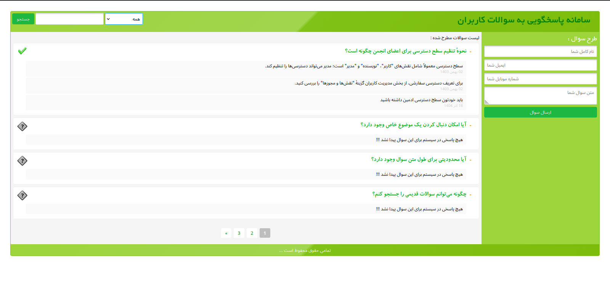

#  انجمن پرسش و پاسخ (PHP Forum)

یک انجمن سبک و قابل توسعه نوشته‌شده با PHP خام برای ثبت، پیگیری و مدیریت پرسش‌ها و مشکلات کاربران. این پروژه امکاناتی مانند ایجاد پرسش، صفحه‌بندی، افزودن پاسخ نامحدود، حذف و ویرایش پاسخ‌ها، تایید یا لغو تایید پرسش‌ها توسط مدیر، جستجو و فیلتر بر اساس وضعیت، نمایش تاریخ شمسی، امنیت و اعتبارسنجی فرم‌ها و تعیین سطوح دسترسی را فراهم می‌کند.



  

## ✨ ویژگی‌های پروژه
-   📝 ایجاد پرسش و پاسخ‌های نامحدود
-   👥 سیستم مدیریت کاربران و سطوح دسترسی
-   🔍 جستجو و فیلتر پیشرفته پرسش‌ها
-   📊 فیلتر بر اساس وضعیت‌های مختلف:
    -   در حال تایید
    -   پاسخ داده شده
    -   تایید شده
    -   حل شده
-   ⚙️ صفحه‌بندی (Pagination)
-   ✅ تایید/لغو تایید مشکلات توسط مدیر
-   ✏️ ویرایش و حذف پاسخ‌ها
-   📅 شمسی‌سازی تاریخ‌ها
-   🔒 امنیت و اعتبارسنجی فرم‌ها
-   🛡️ محافظت در برابر حملات رایج وب

## 📋 پیش‌نیازها
- PHP 8.3 یا بالاتر
- MySQL 15 یا بالاتر
- Composer
- Npm
- Apache

## 🛠️ نصب و راه‌اندازی

### مرحله ۱ : دریافت پروژه

```bash
git clone https://github.com/nerdy-panda/php-pure-forum.git
cd php-pure-forum
```

### مرحله ۲: نصب وابستگی‌ها

```bash
 composer install
```
```bash
 npm install
```
### مرحله ۳: ایجاد shortcut از پوشه node_modules در پوشه public 
```bash
 ln -s /{absolute_path}/node_modules ./Public
```
### مرحله 4 : ایجاد پایگاه داده
1. ابتدا یک database برای پروژه ایجاد کنید
2. سپس فایل database.sql را در ان import کنید تا جداول ساخته شوند 
3. و در اخر تنظیمات database را از فایل Config/Database.php مطابق با نیازتان تغییر دهید 

### مرحله 5 : تنظیم url برای پروژه
- در فایل Constant/Application.php میتوانید برای پروژه یک url تعیین کنید 
```php
    const URL = "http://localhost/forum/Public/";
```
- تعیین url درخواست های ajax برای ادمین در فایل Public/Js/admin.js
```javascript
    const baseUrl = 'http://domain.com/php-forum/Public/';
```

## 🧪 تست و اجرای پروژه
- برای اجرای پروژه باید از پوشه Public فایل index.php را با مرورگر خود باز کنید
- برای ورود ادمین باید به سراغ صفحه login.php بروید و برای ورود از نام کاربری و گذرواژه زیر استفاده کنید 
```
    USERNAME : root 
    PASSWORD : root
```

### 🙏 تشکر
⭐ اگر این پروژه برای شما مفید بود، لطفاً در گیت‌هاب ستاره دهید!
